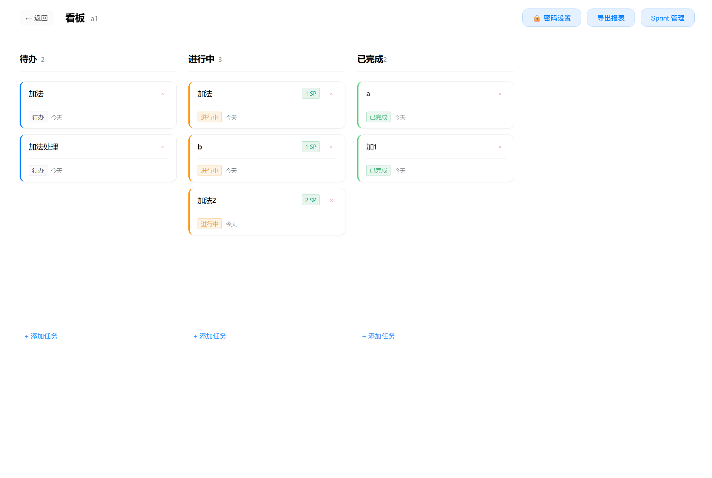
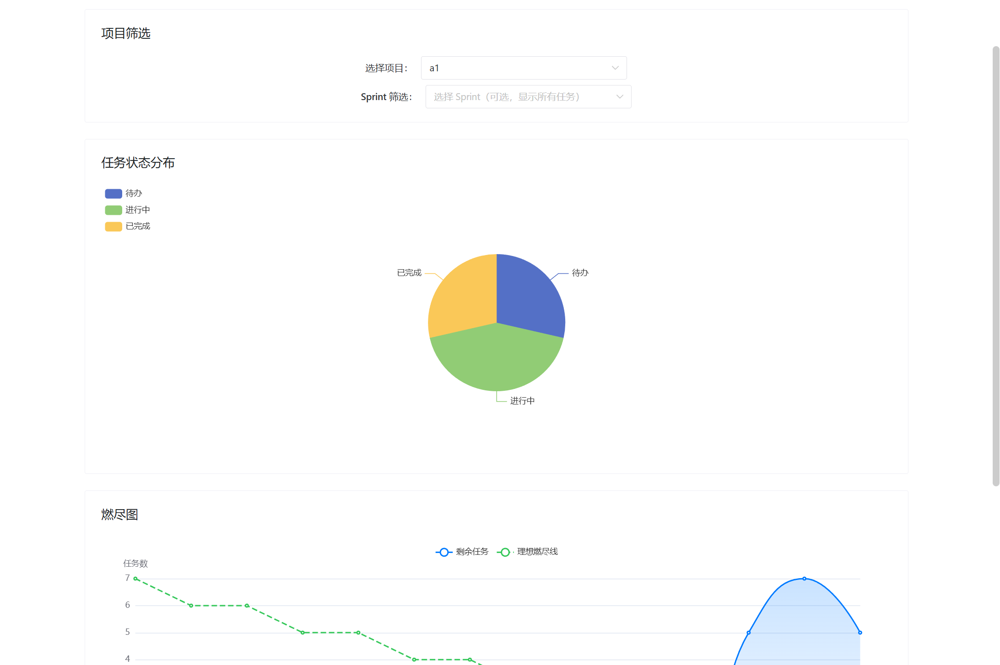
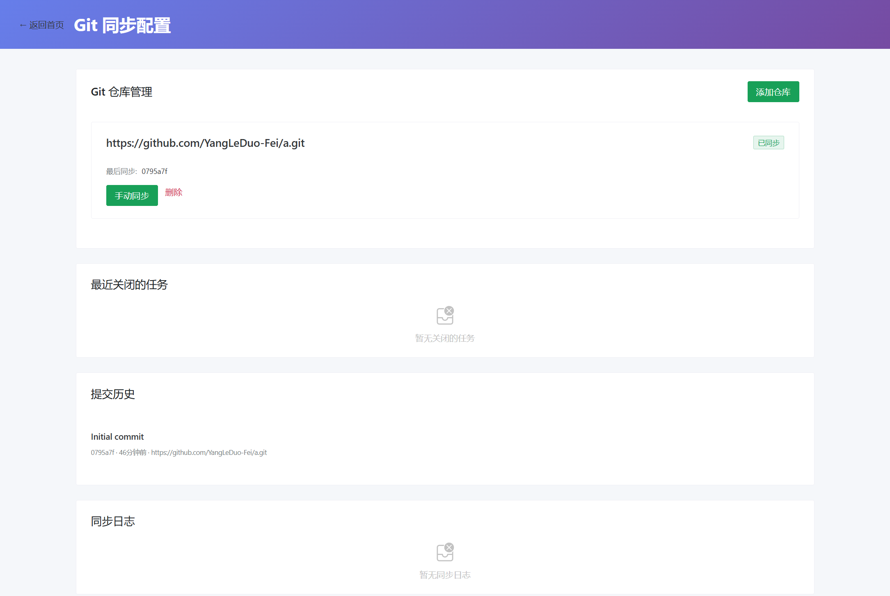

# AgileLocal - 本地敏捷项目管理平台


> **100% 本地运行 · 数据永不离开你的电脑 · 隐私极致保护**

为隐私敏感的个人和小团队打造的开源本地敏捷项目管理工具，支持看板、燃尽图、Sprint 管理、Git 集成等专业功能，所有数据加密存储在本地，无需联网，永不泄露。

## ✨ 核心特性

### 🔒 隐私与安全
- ✅ **完全本地运行**：无需联网，数据永不离开你的电脑
- ✅ **数据库加密**：SQLCipher + AES-256-GCM 双重加密保护
- ✅ **主密码保护**：使用 Electron safeStorage 或 PBKDF2 + AES-256-GCM 加密密钥
- ✅ **项目级密码**：为敏感项目单独设置访问密码
- ✅ **数据永不外传**：所有数据存储在本地加密数据库

### 📊 专业项目管理
- ✅ **看板视图**：直观的拖拽式任务管理，支持跨列拖拽（变更状态）和同列排序
- ✅ **任务详情**：支持标题、描述、故事点、负责人、截止日期、优先级
- ✅ **逾期提醒**：自动高亮逾期任务（红色边框 + "逾期"标签）
- ✅ **实时统计**：燃尽图、任务状态分布、项目进度一目了然
- ✅ **Sprint 管理**：创建和管理 Sprint，燃尽图支持 Sprint 筛选

### 🔄 Git 集成
- ✅ **仓库同步**：连接 Git 仓库，自动同步提交记录
- ✅ **自动关闭任务**：Git 提交信息包含 `#task-123` 时自动关闭对应任务
- ✅ **提交历史**：查看完整的提交记录和最近关闭的任务列表

### 🎨 优雅界面
- ✅ **苹果风格 UI**：极简设计，大量留白，圆角卡片，柔和阴影
- ✅ **深色模式**：完美支持深色主题，自动适配系统偏好
- ✅ **响应式布局**：适配不同窗口尺寸，支持项目搜索、分组、分页
- ✅ **流畅动画**：平滑的拖拽效果和页面过渡

### 🛠 系统功能
- ✅ **备份恢复**：一键备份数据库，支持恢复历史版本
- ✅ **报表导出**：支持导出项目报表为 Markdown 格式
- ✅ **跨平台支持**：Windows、macOS、Linux 全平台支持

## 📸 界面展示

### 主界面与项目列表

> 清晰的项目列表，支持搜索、分组、分页，锁图标标识受密码保护的项目

### 看板视图

> 直观的三列看板（待办/进行中/已完成），支持拖拽排序，任务卡片显示截止日期、优先级、负责人等信息

### 燃尽图与统计

> 实时燃尽图显示任务完成趋势，支持 Sprint 筛选，包含任务状态分布饼图

### Git 同步配置

> 配置 Git 仓库，查看同步状态和提交历史，自动识别任务关闭标记

### 系统设置

> 深色模式切换、备份恢复、项目密码管理等系统功能

## 🚀 快速开始

### 安装方式

#### 方式一：下载预编译版本（推荐）

访问 [Releases 页面](https://github.com/yourusername/AgileLocal/releases) 下载对应平台的安装包：

- **Windows**: `AgileLocal-Setup-x.x.x.exe`
- **macOS**: `AgileLocal-x.x.x.dmg`
- **Linux**: `AgileLocal-x.x.x.AppImage`

#### 方式二：开发模式运行

```bash
# 克隆项目
git clone https://github.com/yourusername/AgileLocal.git
cd AgileLocal

# 安装依赖
npm install

# 启动开发模式
npm run dev
```

#### 方式三：本地打包

```bash
# 构建应用
npm run build

# 构建完成后，安装包在 dist 目录
```

### 首次使用

1. **启动应用**：首次运行会提示设置主密码（如果系统不支持 safeStorage）
2. **创建项目**：点击"创建项目"按钮，输入项目名称和描述
3. **开始工作**：进入看板视图，创建任务并开始跟踪进度

## 🏗 技术栈

### 前端技术
- **框架**: Vue 3 (Composition API) + TypeScript
- **UI 组件库**: Naive UI
- **状态管理**: Pinia (带持久化插件)
- **路由**: Vue Router
- **图表**: ECharts
- **拖拽**: sortablejs
- **样式**: Tailwind CSS (部分) + 自定义 CSS

### 后端技术
- **运行时**: Electron
- **数据库**: better-sqlite3-multiple-ciphers (SQLCipher)
- **ORM**: Kysely
- **加密**: 
  - Electron safeStorage (优先)
  - AES-256-GCM + PBKDF2 (备用)

### 开发工具
- **构建工具**: Vite
- **包管理**: npm
- **代码规范**: ESLint + TypeScript
- **Git 集成**: Octokit
- **定时任务**: node-schedule

## 🔐 安全与隐私

### 数据库加密

AgileLocal 使用多层加密保护您的数据：

1. **数据库层加密**：使用 SQLCipher 对整个数据库文件进行加密
2. **密钥保护**：数据库密钥使用以下方式之一加密存储：
   - **safeStorage**（优先）：使用 Electron 的系统密钥链（Windows Credential Manager / macOS Keychain）
   - **PBKDF2 + AES-256-GCM**（备用）：使用主密码派生密钥，100,000 次迭代

### 主密码设置

- 首次启动时，如果系统不支持 safeStorage，会提示设置主密码（至少 12 个字符）
- 主密码用于加密数据库密钥，丢失无法恢复，请妥善保管
- 主密码验证通过后，才会解密数据库并加载数据

### 项目级密码保护

- 可以为敏感项目单独设置访问密码
- 使用 AES-256-GCM + PBKDF2 加密存储项目密码
- 访问受保护的项目时需要输入密码验证

### 数据存储位置

- **Windows**: `%APPDATA%\AgileLocal\`
- **macOS**: `~/Library/Application Support/AgileLocal/`
- **Linux**: `~/.config/AgileLocal/`

所有数据（数据库、加密密钥、日志）都存储在本地，**永不上传到任何服务器**。

## 📁 项目结构

```
AgileLocal/
├── src/
│   ├── main/              # Electron 主进程
│   │   ├── database/      # 数据库连接与迁移
│   │   ├── services/      # 业务逻辑服务层
│   │   ├── ipc/           # IPC 通信处理
│   │   ├── security/      # 密钥管理与加密
│   │   └── index.ts       # 主进程入口
│   ├── renderer/          # Vue 渲染进程
│   │   ├── components/    # Vue 组件
│   │   ├── views/         # 页面视图
│   │   ├── stores/        # Pinia 状态管理
│   │   └── router/        # 路由配置
│   └── preload/           # 预加载脚本（桥接主进程和渲染进程）
├── scripts/               # 构建脚本
├── package.json
└── README.md
```

## 🤝 开发与贡献

### 开发环境要求

- Node.js >= 18.x
- npm >= 9.x
- Git

### 开发流程

1. Fork 本仓库
2. 创建特性分支 (`git checkout -b feature/AmazingFeature`)
3. 提交更改 (`git commit -m 'Add some AmazingFeature'`)
4. 推送到分支 (`git push origin feature/AmazingFeature`)
5. 开启 Pull Request

### 代码规范

- 使用 TypeScript 严格模式
- 遵循 Vue 3 Composition API 最佳实践
- 使用 ESLint 进行代码检查
- 提交前运行 `npm run lint` 确保代码质量

### 已知问题与限制

- 当前版本专注于单用户场景，多用户协作功能待开发
- Git 集成需要本地已配置 Git 凭证
- 大项目（>1000 个任务）的性能优化仍在进行中

## 📄 许可证

本项目采用 [MIT 许可证](LICENSE)。

## 🙏 致谢

感谢以下优秀的开源项目：

- [Electron](https://www.electronjs.org/) - 跨平台桌面应用框架
- [Vue.js](https://vuejs.org/) - 渐进式 JavaScript 框架
- [Naive UI](https://www.naiveui.com/) - 高质量的 Vue 3 组件库
- [Kysely](https://kysely.dev/) - 类型安全的 SQL 查询构建器
- [ECharts](https://echarts.apache.org/) - 强大的数据可视化库
- [sortablejs](https://sortablejs.github.io/Sortable/) - 可拖拽列表库
- [better-sqlite3](https://github.com/WiseLibs/better-sqlite3) - 高性能 SQLite3 绑定

## 📞 联系方式

- **Issues**: [GitHub Issues](https://github.com/yourusername/AgileLocal/issues)
- **讨论**: [GitHub Discussions](https://github.com/yourusername/AgileLocal/discussions)

## ⚠️ 项目状态

本项目目前处于**活跃开发中**，功能持续迭代更新。欢迎提交 Issue 和 Pull Request！

---

**⭐ 如果这个项目对你有帮助，请给一个 Star 支持一下！**
